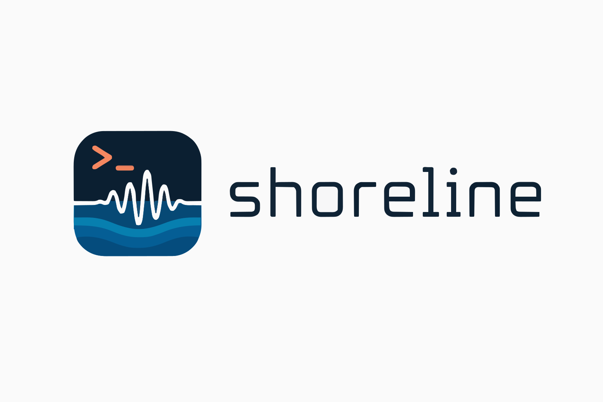
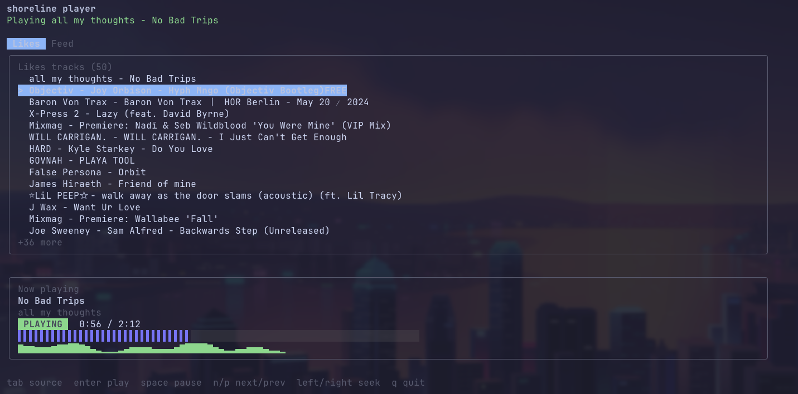

[](https://github.com/levievans/shoreline) [](LICENSE) [](https://pkg.go.dev/github.com/levievans/shoreline) [](https://github.com/levievans/shoreline/actions/workflows/ci.yml)

`shoreline` is a SoundCloud terminal player, written in Go, so you can keep control of your tunes right next to your code.



The CLI binary is `sl`. It authenticates with SoundCloud, lists a few personal collections, and can hand tracks off to [`mpv`](https://mpv.io/) for playback.

Shoreline is still early. The feed, likes, playlists, login, one-shot playback, and full-screen player paths are usable; stats are currently a placeholder though.


## Setup

Prerequisites:

- Go 1.25 or newer
- `mpv` for playback (make sure `mpv` is available on `PATH`)
- SoundCloud application credentials (`client_id` and `client_secret`) note that will require an Artist or Pro account
- [`just`](https://github.com/casey/just) if you are cloning the repo and using the development commands (optional)

Install the latest public version directly with Go:

```bash
go install github.com/levievans/shoreline/cmd/sl@latest
sl help
```

or alternatively, clone the repository and use the development commands:

```bash
git clone https://github.com/levievans/shoreline.git
```
then,

```bash
cd shoreline
just install
sl help
```

which will require you to have [`just`](https://github.com/casey/just) installed.

Then, run `sl login` to authenticate with SoundCloud, following the instructions in the browser.

```bash
sl login
```

Then, run `sl player` to open the full-screen terminal player and start listening to your tracks.

```bash
sl player
```

## Commands

| Command | Description |
| --- | --- |
| `sl help` | Prints the help text for all commands. |
| `sl login` | Starts the SoundCloud OAuth flow, opens your browser, handles the localhost callback, and stores tokens for later commands. |
| `sl player` | Opens the full-screen terminal player with liked tracks, playable feed tracks, queue controls, and a long-running `mpv` process. |
| `sl feed` | Prints the latest items from your SoundCloud feed, including tracks, playlists, reposts, and user activity labels. |
| `sl likes` | Lists your liked tracks with an index, artist, title, and duration. |
| `sl playlists` | Lists your playlists with an index, title, track count, and owner. |
| `sl play <likes\|feed> <index>` | Plays a track by index from either `sl likes` or `sl feed`. |
| `sl stats` | Reserved for local listening stats. Not implemented yet. |

Example one-shot playback:

```bash
sl likes
sl play likes 3

sl feed
sl play feed 1
```

Playback requires `mpv` to be installed and available on `PATH`.

`sl player` controls:

| Key | Action |
| --- | --- |
| `tab` | Switch between likes and feed. |
| `up` / `down` or `k` / `j` | Move selection. |
| `enter` | Play selected track. |
| `space` | Pause or resume. |
| `n` / `p` | Play the next or previous track in the queue. |
| `left` / `right` or `h` / `l` | Seek backward or forward. |
| `q` / `ctrl+c` | Quit and stop playback. |

Planned ideas include uploads, playlist expansion inside the player, and local listening history.


## dev stuff

Build:

```bash
just build
```

useful commands:

```bash
just install-hooks
just test
just fmt
just tidy
```

`just install-hooks` installs a local pre-commit hook that scans staged files for common secret filenames, private keys, and token-like assignments before each commit.

For local development, you can keep Shoreline's generated state inside the repo and provide SoundCloud credentials through environment variables:

```bash
export SHORELINE_CONFIG_DIR="$(pwd)/.shoreline"
export SHORELINE_SOUNDCLOUD_CLIENT_ID="..."
export SHORELINE_SOUNDCLOUD_CLIENT_SECRET="..."
```

Optional redirect URL override:

```bash
export SHORELINE_SOUNDCLOUD_REDIRECT_URL="http://127.0.0.1:9876/callback"
```

You can also set non-secret defaults in `config.json` inside your config dir:

```json
{
  "soundcloud": {
    "redirect_url": "http://127.0.0.1:9876/callback"
  }
}
```

Precedence for `redirect_url` is: environment variable -> `config.json` -> `state.json` -> default.

On macOS, `shoreline` stores SoundCloud credentials and OAuth tokens in the
Keychain under the `shoreline` service. The environment variables above are
only needed the first time, or when you want to overwrite the stored values.

On other platforms (or when Keychain is unavailable), `shoreline` falls back to
storing these secrets in `secrets.json` inside the config dir with `0600`
permissions. Keep that directory out of source control.

## Project Notes

Shoreline is an unofficial SoundCloud client and is not affiliated with or endorsed by SoundCloud. Use your own SoundCloud application credentials and follow SoundCloud's terms when using the API.

Security issues can be reported privately using the guidance in [SECURITY.md](SECURITY.md).

Shoreline is released under the MIT License. See [LICENSE](LICENSE).

### Technical breakdown

At startup, `cmd/sl` wires together a small set of internal packages. `internal/config` resolves the config directory, `config.json`, `state.json`, and the future local database path. During development, `SHORELINE_CONFIG_DIR` is useful because it keeps all local state under a predictable directory.

`internal/auth` manages the SoundCloud OAuth flow. Login uses an authorisation-code flow with PKCE: Shoreline generates a verifier/challenge pair, starts a temporary localhost callback server, opens the browser, validates the returned `state`, exchanges the code for tokens, and refreshes access tokens when they are close to expiring.

`internal/soundcloud` wraps the SoundCloud API calls used by the CLI. It fetches `/me/activities`, `/me/likes/tracks`, and `/me/playlists`, normalizes the mixed activity payloads from the feed, and resolves selected tracks into playable stream URLs.

Playback lives in `internal/player`. One-shot playback shells out to `mpv`, while the full-screen player starts `mpv` in idle mode with JSON IPC enabled. The controller sends commands such as `loadfile`, `cycle pause`, `seek`, and `stop`, and listens for property changes like `time-pos`, `duration`, `pause`, and `idle-active`.

The terminal interface lives in `internal/tui`, built on Charm's Bubble Tea stack. It keeps the UI model separate from side effects: commands load SoundCloud sources, resolve stream URLs, and talk to the player controller, while the model renders source lists, queue state, errors, and playback progress.

Secrets and local state are split intentionally. Non-secret preferences live in `config.json`, account metadata and redirect history live in `state.json`, and credentials or tokens go to Keychain on macOS or `secrets.json` elsewhere.

Stats are intended to be computed from local playback history rather than SoundCloud analytics.